<!-- Animated hero -->

  

<!-- Contribution graph -->
<h3>$ ./contributions</h3>

  

<!-- whoami -->
<h3>$ whoami</h3>
<table>
  <tr>
    <td valign="top"></td>
    <td valign="top"></td>
  </tr>
</table>

  

<!-- Projects -->
<h3>$ ls projects</h3>

  

<!-- Skills -->
<h3>$ cat skills.txt</h3>

  

<!-- Timeline -->
<h3>$ git log</h3>

  

<!-- Contact -->
<h3>$ contact --help</h3>

  <a href="https://github.com/CodewithShiva-286">github.com/CodewithShiva-286</a>

 

<!-- Footer -->
generated locally · refreshed daily via GitHub Actions · no external stats APIs

